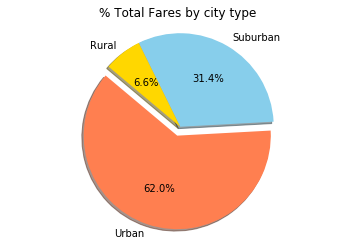
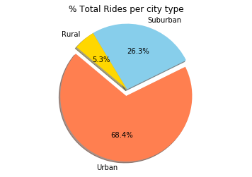
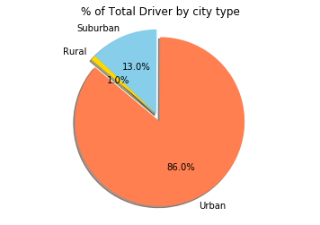
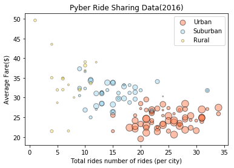

```python
Observed Trend 1: The total rides, drivers, and fares are the highest in the Urban areas
Observed Trend 2: The average fare is pretty close in the Suburban and Rural areas
Observed Trend 3: The % of drivers in the Suburban areas are increasing which would eventually lead to the increase in the total number rides and fares
```


      File "<ipython-input-1-804d171f9a9d>", line 1
        Observed Trend 1: The total rides, drivers, and fares are the highest in the Urban areas
                     ^
    SyntaxError: invalid syntax


```python
import os
import pandas as pd
import matplotlib.pyplot as plt
import numpy as np
```


```python
csvpath = os.path.join('..', 'city_data.csv')
city_data = pd.read_csv(csvpath)
city_data.head()
```


<div>
<style>
    .dataframe thead tr:only-child th {
        text-align: right;
    }

    .dataframe thead th {
        text-align: left;
    }

    .dataframe tbody tr th {
        vertical-align: top;
    }
</style>
<table border="1" class="dataframe">
  <thead>
    <tr style="text-align: right;">
      <th></th>
      <th>city</th>
      <th>driver_count</th>
      <th>type</th>
    </tr>
  </thead>
  <tbody>
    <tr>
      <th>0</th>
      <td>Kelseyland</td>
      <td>63</td>
      <td>Urban</td>
    </tr>
    <tr>
      <th>1</th>
      <td>Nguyenbury</td>
      <td>8</td>
      <td>Urban</td>
    </tr>
    <tr>
      <th>2</th>
      <td>East Douglas</td>
      <td>12</td>
      <td>Urban</td>
    </tr>
    <tr>
      <th>3</th>
      <td>West Dawnfurt</td>
      <td>34</td>
      <td>Urban</td>
    </tr>
    <tr>
      <th>4</th>
      <td>Rodriguezburgh</td>
      <td>52</td>
      <td>Urban</td>
    </tr>
  </tbody>
</table>
</div>


```python
csvpath1 = os.path.join('..', 'ride_data.csv')
ride_data = pd.read_csv(csvpath1)
ride_data.head()
```


<div>
<style>
    .dataframe thead tr:only-child th {
        text-align: right;
    }

    .dataframe thead th {
        text-align: left;
    }

    .dataframe tbody tr th {
        vertical-align: top;
    }
</style>
<table border="1" class="dataframe">
  <thead>
    <tr style="text-align: right;">
      <th></th>
      <th>city</th>
      <th>date</th>
      <th>fare</th>
      <th>ride_id</th>
    </tr>
  </thead>
  <tbody>
    <tr>
      <th>0</th>
      <td>Sarabury</td>
      <td>1/16/16 13:49</td>
      <td>38.35</td>
      <td>5.403690e+12</td>
    </tr>
    <tr>
      <th>1</th>
      <td>South Roy</td>
      <td>1/2/16 18:42</td>
      <td>17.49</td>
      <td>4.036270e+12</td>
    </tr>
    <tr>
      <th>2</th>
      <td>Wiseborough</td>
      <td>1/21/16 17:35</td>
      <td>44.18</td>
      <td>3.645040e+12</td>
    </tr>
    <tr>
      <th>3</th>
      <td>Spencertown</td>
      <td>7/31/16 14:53</td>
      <td>6.87</td>
      <td>2.242600e+12</td>
    </tr>
    <tr>
      <th>4</th>
      <td>Nguyenbury</td>
      <td>7/9/16 4:42</td>
      <td>6.28</td>
      <td>1.543060e+12</td>
    </tr>
  </tbody>
</table>
</div>


```python
merge_data = pd.merge(ride_data, city_data, on = 'city', how = 'outer')
#merge_data = merge_data.set_index("type")
merge_data.head()
```


<div>
<style>
    .dataframe thead tr:only-child th {
        text-align: right;
    }

    .dataframe thead th {
        text-align: left;
    }

    .dataframe tbody tr th {
        vertical-align: top;
    }
</style>
<table border="1" class="dataframe">
  <thead>
    <tr style="text-align: right;">
      <th></th>
      <th>city</th>
      <th>date</th>
      <th>fare</th>
      <th>ride_id</th>
      <th>driver_count</th>
      <th>type</th>
    </tr>
  </thead>
  <tbody>
    <tr>
      <th>0</th>
      <td>Sarabury</td>
      <td>1/16/16 13:49</td>
      <td>38.35</td>
      <td>5.403690e+12</td>
      <td>46</td>
      <td>Urban</td>
    </tr>
    <tr>
      <th>1</th>
      <td>Sarabury</td>
      <td>7/23/16 7:42</td>
      <td>21.76</td>
      <td>7.546680e+12</td>
      <td>46</td>
      <td>Urban</td>
    </tr>
    <tr>
      <th>2</th>
      <td>Sarabury</td>
      <td>4/2/16 4:32</td>
      <td>38.03</td>
      <td>4.932500e+12</td>
      <td>46</td>
      <td>Urban</td>
    </tr>
    <tr>
      <th>3</th>
      <td>Sarabury</td>
      <td>6/23/16 5:03</td>
      <td>26.82</td>
      <td>6.711040e+12</td>
      <td>46</td>
      <td>Urban</td>
    </tr>
    <tr>
      <th>4</th>
      <td>Sarabury</td>
      <td>9/30/16 12:48</td>
      <td>30.30</td>
      <td>6.388740e+12</td>
      <td>46</td>
      <td>Urban</td>
    </tr>
  </tbody>
</table>
</div>


```python
scatter_urban_data = merge_data[merge_data['type'] == 'Urban']
scatter_suburban_data = merge_data[merge_data['type'] == 'Suburban']
scatter_rural_data = merge_data[merge_data['type'] == 'Rural']
scatter_urban_data = scatter_urban_data.sum()
scatter_suburban_data = scatter_suburban_data.sum()
scatter_rural_data = scatter_rural_data.sum()
print(scatter_urban_data)
print(scatter_suburban_data)
print(scatter_rural_data)

```

    city            SaraburySaraburySaraburySaraburySaraburySarabu...
    date            1/16/16 13:497/23/16 7:424/2/16 4:326/23/16 5:...
    fare                                                      40078.3
    ride_id                                               7.89019e+15
    driver_count                                                64501
    type            UrbanUrbanUrbanUrbanUrbanUrbanUrbanUrbanUrbanU...
    dtype: object
    city            Port JamesPort JamesPort JamesPort JamesPort J...
    date            12/4/16 6:1612/4/16 6:165/16/16 21:255/16/16 2...
    fare                                                      20335.7
    ride_id                                               3.13958e+15
    driver_count                                                 9730
    type            SuburbanSuburbanSuburbanSuburbanSuburbanSuburb...
    dtype: object
    city            HornelandHornelandHornelandHornelandKinghavenK...
    date            7/19/16 10:073/22/16 21:221/26/16 9:383/25/16 ...
    fare                                                      4255.09
    ride_id                                               6.58729e+14
    driver_count                                                  727
    type            RuralRuralRuralRuralRuralRuralRuralRuralRuralR...
    dtype: object


```python

```


```python
#average city ride fare
city_fare = merge_data.groupby(['city', 'type', 'driver_count'])
# urban_fare = merge_data.loc[['Urban'],['city','fare','driver_count']]
# urban_fare['Average Fare'] = urban_fare['fare'].mean()
# urban_fare['Total number of Rides'] = urban_fare['fare'].count()

# city_fare_agg = pd.DataFrame(city_fare)
city_fare_agg = city_fare['fare'].agg(['sum','count']).reset_index(level=1)
#urban_city = urban_fare.groupby(['type', 'city'])
#city_fare_agg = city_fare_agg.rename(columns={"count": "Total", "type": "ciyt_type"})
# # city_fare = city_fare["Total"]
#city_fare_agg.head()
#city_fare_agg.head()
city_fare_agg.head()

```


<div>
<style>
    .dataframe thead tr:only-child th {
        text-align: right;
    }

    .dataframe thead th {
        text-align: left;
    }

    .dataframe tbody tr th {
        vertical-align: top;
    }
</style>
<table border="1" class="dataframe">
  <thead>
    <tr style="text-align: right;">
      <th></th>
      <th></th>
      <th>type</th>
      <th>sum</th>
      <th>count</th>
    </tr>
    <tr>
      <th>city</th>
      <th>driver_count</th>
      <th></th>
      <th></th>
      <th></th>
    </tr>
  </thead>
  <tbody>
    <tr>
      <th>Alvarezhaven</th>
      <th>21</th>
      <td>Urban</td>
      <td>741.79</td>
      <td>31</td>
    </tr>
    <tr>
      <th>Alyssaberg</th>
      <th>67</th>
      <td>Urban</td>
      <td>535.85</td>
      <td>26</td>
    </tr>
    <tr>
      <th>Anitamouth</th>
      <th>16</th>
      <td>Suburban</td>
      <td>335.84</td>
      <td>9</td>
    </tr>
    <tr>
      <th>Antoniomouth</th>
      <th>21</th>
      <td>Urban</td>
      <td>519.75</td>
      <td>22</td>
    </tr>
    <tr>
      <th>Aprilchester</th>
      <th>49</th>
      <td>Urban</td>
      <td>417.65</td>
      <td>19</td>
    </tr>
  </tbody>
</table>
</div>


```python
city_fare_agg['Average'] = city_fare_agg['sum']/city_fare_agg['count']
# city_fare_agg1 = city_fare_agg.set_index("type")
city_fare_agg1 = city_fare_agg.loc[city_fare_agg['type']== 'Urban', ['sum', 'count', 'Average']]
city_fare_agg1 = city_fare_agg1.rename(columns={'sum': 'FareTotal', 'count': 'Ridecount', 'Average': 'AverageFare'})
city_fare_agg1.head()
```


<div>
<style>
    .dataframe thead tr:only-child th {
        text-align: right;
    }

    .dataframe thead th {
        text-align: left;
    }

    .dataframe tbody tr th {
        vertical-align: top;
    }
</style>
<table border="1" class="dataframe">
  <thead>
    <tr style="text-align: right;">
      <th></th>
      <th></th>
      <th>FareTotal</th>
      <th>Ridecount</th>
      <th>AverageFare</th>
    </tr>
    <tr>
      <th>city</th>
      <th>driver_count</th>
      <th></th>
      <th></th>
      <th></th>
    </tr>
  </thead>
  <tbody>
    <tr>
      <th>Alvarezhaven</th>
      <th>21</th>
      <td>741.79</td>
      <td>31</td>
      <td>23.928710</td>
    </tr>
    <tr>
      <th>Alyssaberg</th>
      <th>67</th>
      <td>535.85</td>
      <td>26</td>
      <td>20.609615</td>
    </tr>
    <tr>
      <th>Antoniomouth</th>
      <th>21</th>
      <td>519.75</td>
      <td>22</td>
      <td>23.625000</td>
    </tr>
    <tr>
      <th>Aprilchester</th>
      <th>49</th>
      <td>417.65</td>
      <td>19</td>
      <td>21.981579</td>
    </tr>
    <tr>
      <th>Arnoldview</th>
      <th>41</th>
      <td>778.30</td>
      <td>31</td>
      <td>25.106452</td>
    </tr>
  </tbody>
</table>
</div>


```python
sort_data = city_fare_agg1.reset_index()
sort_data.head()
```


<div>
<style>
    .dataframe thead tr:only-child th {
        text-align: right;
    }

    .dataframe thead th {
        text-align: left;
    }

    .dataframe tbody tr th {
        vertical-align: top;
    }
</style>
<table border="1" class="dataframe">
  <thead>
    <tr style="text-align: right;">
      <th></th>
      <th>city</th>
      <th>driver_count</th>
      <th>FareTotal</th>
      <th>Ridecount</th>
      <th>AverageFare</th>
    </tr>
  </thead>
  <tbody>
    <tr>
      <th>0</th>
      <td>Alvarezhaven</td>
      <td>21</td>
      <td>741.79</td>
      <td>31</td>
      <td>23.928710</td>
    </tr>
    <tr>
      <th>1</th>
      <td>Alyssaberg</td>
      <td>67</td>
      <td>535.85</td>
      <td>26</td>
      <td>20.609615</td>
    </tr>
    <tr>
      <th>2</th>
      <td>Antoniomouth</td>
      <td>21</td>
      <td>519.75</td>
      <td>22</td>
      <td>23.625000</td>
    </tr>
    <tr>
      <th>3</th>
      <td>Aprilchester</td>
      <td>49</td>
      <td>417.65</td>
      <td>19</td>
      <td>21.981579</td>
    </tr>
    <tr>
      <th>4</th>
      <td>Arnoldview</td>
      <td>41</td>
      <td>778.30</td>
      <td>31</td>
      <td>25.106452</td>
    </tr>
  </tbody>
</table>
</div>


```python
city_fare_agg_pie1 = city_fare_agg1.sum()
city_fare_agg_pie1
```


    FareTotal      40078.34000
    Ridecount       1625.00000
    AverageFare     1623.86339
    dtype: float64


```python
city_fare_agg2 = city_fare_agg.loc[city_fare_agg['type']== 'Suburban', ['sum', 'count', 'Average']]
city_fare_agg2 = city_fare_agg2.rename(columns={'sum': 'FareTotal', 'count': 'Ridecount', 'Average': 'AverageFare'})
city_fare_agg2.head()
```


<div>
<style>
    .dataframe thead tr:only-child th {
        text-align: right;
    }

    .dataframe thead th {
        text-align: left;
    }

    .dataframe tbody tr th {
        vertical-align: top;
    }
</style>
<table border="1" class="dataframe">
  <thead>
    <tr style="text-align: right;">
      <th></th>
      <th></th>
      <th>FareTotal</th>
      <th>Ridecount</th>
      <th>AverageFare</th>
    </tr>
    <tr>
      <th>city</th>
      <th>driver_count</th>
      <th></th>
      <th></th>
      <th></th>
    </tr>
  </thead>
  <tbody>
    <tr>
      <th>Anitamouth</th>
      <th>16</th>
      <td>335.84</td>
      <td>9</td>
      <td>37.315556</td>
    </tr>
    <tr>
      <th>Campbellport</th>
      <th>26</th>
      <td>505.67</td>
      <td>15</td>
      <td>33.711333</td>
    </tr>
    <tr>
      <th>Carrollbury</th>
      <th>4</th>
      <td>366.06</td>
      <td>10</td>
      <td>36.606000</td>
    </tr>
    <tr>
      <th>Clarkstad</th>
      <th>21</th>
      <td>372.62</td>
      <td>12</td>
      <td>31.051667</td>
    </tr>
    <tr>
      <th>Conwaymouth</th>
      <th>18</th>
      <td>380.51</td>
      <td>11</td>
      <td>34.591818</td>
    </tr>
  </tbody>
</table>
</div>


```python
sort_data1 = city_fare_agg2.reset_index()
sort_data1.head()

```


<div>
<style>
    .dataframe thead tr:only-child th {
        text-align: right;
    }

    .dataframe thead th {
        text-align: left;
    }

    .dataframe tbody tr th {
        vertical-align: top;
    }
</style>
<table border="1" class="dataframe">
  <thead>
    <tr style="text-align: right;">
      <th></th>
      <th>city</th>
      <th>driver_count</th>
      <th>FareTotal</th>
      <th>Ridecount</th>
      <th>AverageFare</th>
    </tr>
  </thead>
  <tbody>
    <tr>
      <th>0</th>
      <td>Anitamouth</td>
      <td>16</td>
      <td>335.84</td>
      <td>9</td>
      <td>37.315556</td>
    </tr>
    <tr>
      <th>1</th>
      <td>Campbellport</td>
      <td>26</td>
      <td>505.67</td>
      <td>15</td>
      <td>33.711333</td>
    </tr>
    <tr>
      <th>2</th>
      <td>Carrollbury</td>
      <td>4</td>
      <td>366.06</td>
      <td>10</td>
      <td>36.606000</td>
    </tr>
    <tr>
      <th>3</th>
      <td>Clarkstad</td>
      <td>21</td>
      <td>372.62</td>
      <td>12</td>
      <td>31.051667</td>
    </tr>
    <tr>
      <th>4</th>
      <td>Conwaymouth</td>
      <td>18</td>
      <td>380.51</td>
      <td>11</td>
      <td>34.591818</td>
    </tr>
  </tbody>
</table>
</div>


```python
city_fare_agg_pie2 = city_fare_agg2.sum()
city_fare_agg_pie2
```


    FareTotal      20335.690000
    Ridecount        657.000000
    AverageFare     1300.433953
    dtype: float64


```python
city_fare_agg3 = city_fare_agg.loc[city_fare_agg['type']== 'Rural', ['sum', 'count', 'Average']]
city_fare_agg3 = city_fare_agg3.rename(columns={'sum': 'FareTotal', 'count': 'Ridecount', 'Average': 'AverageFare'})
city_fare_agg3.head()
```


<div>
<style>
    .dataframe thead tr:only-child th {
        text-align: right;
    }

    .dataframe thead th {
        text-align: left;
    }

    .dataframe tbody tr th {
        vertical-align: top;
    }
</style>
<table border="1" class="dataframe">
  <thead>
    <tr style="text-align: right;">
      <th></th>
      <th></th>
      <th>FareTotal</th>
      <th>Ridecount</th>
      <th>AverageFare</th>
    </tr>
    <tr>
      <th>city</th>
      <th>driver_count</th>
      <th></th>
      <th></th>
      <th></th>
    </tr>
  </thead>
  <tbody>
    <tr>
      <th>East Leslie</th>
      <th>9</th>
      <td>370.27</td>
      <td>11</td>
      <td>33.660909</td>
    </tr>
    <tr>
      <th>East Stephen</th>
      <th>6</th>
      <td>390.53</td>
      <td>10</td>
      <td>39.053000</td>
    </tr>
    <tr>
      <th>East Troybury</th>
      <th>3</th>
      <td>232.71</td>
      <td>7</td>
      <td>33.244286</td>
    </tr>
    <tr>
      <th>Erikport</th>
      <th>3</th>
      <td>240.35</td>
      <td>8</td>
      <td>30.043750</td>
    </tr>
    <tr>
      <th>Hernandezshire</th>
      <th>10</th>
      <td>288.02</td>
      <td>9</td>
      <td>32.002222</td>
    </tr>
  </tbody>
</table>
</div>


```python
sort_data2 = city_fare_agg3.reset_index()
sort_data2.head()
```


<div>
<style>
    .dataframe thead tr:only-child th {
        text-align: right;
    }

    .dataframe thead th {
        text-align: left;
    }

    .dataframe tbody tr th {
        vertical-align: top;
    }
</style>
<table border="1" class="dataframe">
  <thead>
    <tr style="text-align: right;">
      <th></th>
      <th>city</th>
      <th>driver_count</th>
      <th>FareTotal</th>
      <th>Ridecount</th>
      <th>AverageFare</th>
    </tr>
  </thead>
  <tbody>
    <tr>
      <th>0</th>
      <td>East Leslie</td>
      <td>9</td>
      <td>370.27</td>
      <td>11</td>
      <td>33.660909</td>
    </tr>
    <tr>
      <th>1</th>
      <td>East Stephen</td>
      <td>6</td>
      <td>390.53</td>
      <td>10</td>
      <td>39.053000</td>
    </tr>
    <tr>
      <th>2</th>
      <td>East Troybury</td>
      <td>3</td>
      <td>232.71</td>
      <td>7</td>
      <td>33.244286</td>
    </tr>
    <tr>
      <th>3</th>
      <td>Erikport</td>
      <td>3</td>
      <td>240.35</td>
      <td>8</td>
      <td>30.043750</td>
    </tr>
    <tr>
      <th>4</th>
      <td>Hernandezshire</td>
      <td>10</td>
      <td>288.02</td>
      <td>9</td>
      <td>32.002222</td>
    </tr>
  </tbody>
</table>
</div>


```python
city_fare_agg_pie3 = city_fare_agg2.sum()
city_fare_agg_pie3
```


    FareTotal      20335.690000
    Ridecount        657.000000
    AverageFare     1300.433953
    dtype: float64


```python
labels = ["Urban", "Suburban", "Rural"]

# The values of each section of the pie chart
sizes = [40078.34, 20335.69, 4255.09]

# The colors of each section of the pie chart
colors = ["coral", "skyblue", "gold"]

# Tells matplotlib to separate the "Python" section
# from the others
explode = [0.1, 0, 0]
plt.pie(sizes, labels=labels, colors=colors, explode=explode,
        autopct="{0:1.1f}%".format, shadow=True, startangle=140)
plt.axis("equal")
plt.title("% Total Fares by city type")
plt.show()
```





```python
labels = ["Urban", "Suburban", "Rural"]

# The values of each section of the pie chart
sizes = [1625, 625, 125]

# The colors of each section of the pie chart
colors = ["coral", "skyblue", "gold"]

# Tells matplotlib to separate the "Python" section
# from the others
explode = [0.1, 0, 0]
plt.pie(sizes, labels=labels, colors=colors, explode=explode,
        autopct="{0:1.1f}%".format, shadow=True, startangle=140)
plt.axis("equal")
plt.title("% Total Rides per city type")
plt.show()
```





```python
labels = ["Urban", "Suburban", "Rural"]

# The values of each section of the pie chart
sizes = [64501, 9730, 727]

# The colors of each section of the pie chart
colors = ["coral", "skyblue", "gold"]

# Tells matplotlib to separate the "Python" section
# from the others
explode = [0.1, 0, 0]
plt.pie(sizes, labels=labels, colors=colors, explode=explode,
        autopct="{0:1.1f}%".format, shadow=True, startangle=140)
plt.axis("equal")
plt.title("% of Total Driver by city type")
plt.show()
```





```python
plt.scatter(city_fare_agg1.Ridecount, city_fare_agg1.AverageFare, s=(sort_data.driver_count)*2, marker="o",
            facecolors="coral", label ="Urban", alpha = 0.5, linewidths = '1', edgecolor = 'black')
plt.scatter(city_fare_agg2.Ridecount, city_fare_agg2.AverageFare, s=(sort_data1.driver_count)*3, marker="o",
            facecolors="skyblue", label ="Suburban", alpha = 0.4, linewidths = '1', edgecolor = 'black')
plt.scatter(city_fare_agg3.Ridecount, city_fare_agg3.AverageFare, s=(sort_data2.driver_count)*3, marker="o",
            facecolors="gold", label ="Rural", alpha = 0.3, linewidths = '1', edgecolor = 'black')
plt.legend(loc='best')
plt.xlabel("Total rides number of rides (per city)")
plt.ylabel("Average Fare($)")
plt.title("Pyber Ride Sharing Data(2016)")
plt.show()
```





```python

```


```python

```
